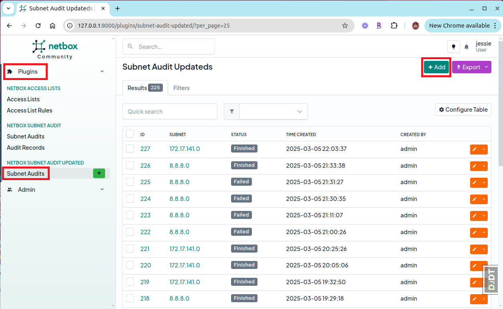
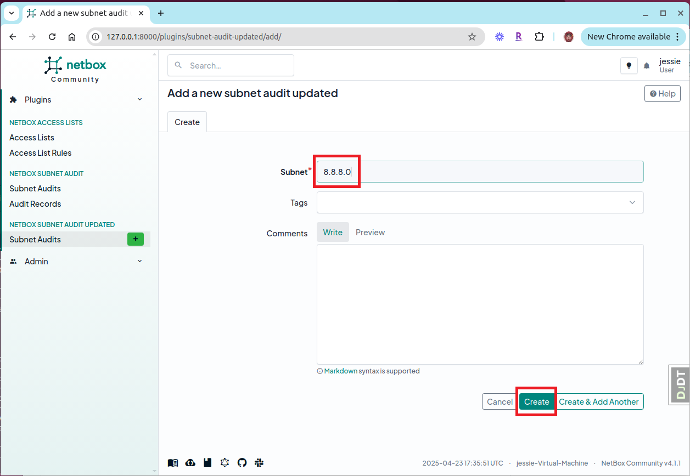
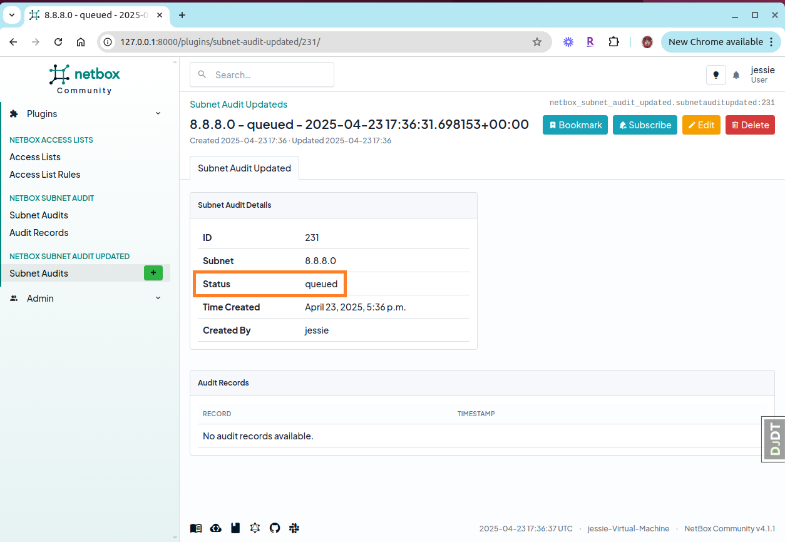
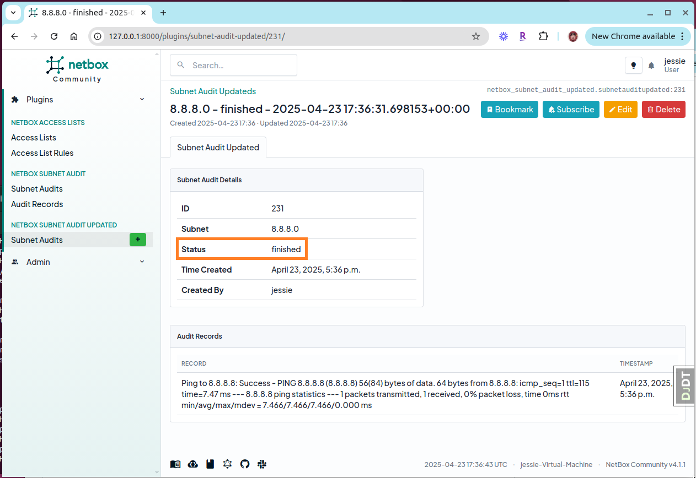
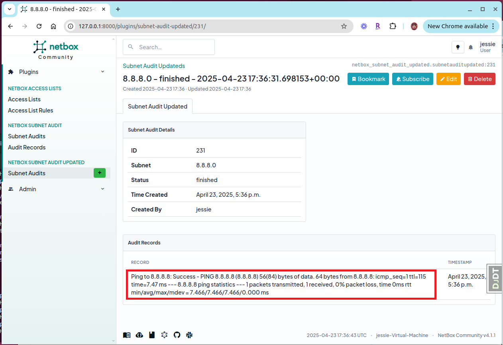
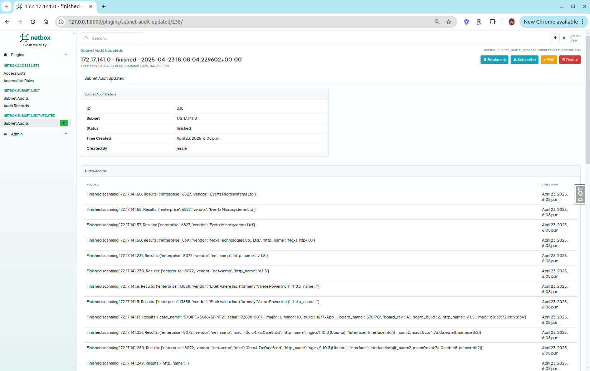
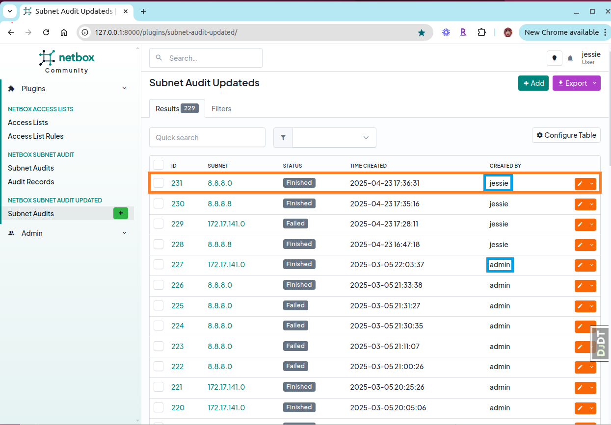

# NetBox Subnet Audit Plugin

A plugin for NetBox that enables detailed subnet auditing with advanced device discovery features. This plugin allows NetBox users to scan subnets to identify active devices and collect detailed information about them.

## Features

- **Subnet Scanning**: Scans entire subnets to discover active devices
- **Device Discovery**: Identifies devices on the network with detailed information
- **Audit History**: Keeps track of all subnet audits with timestamps
- **User Attribution**: Records which user initiated each audit
- **Real-time Status Updates**: Shows the progress of audits as they run
- **Rich Device Information**: For compatible networks, displays device details

## Requirements

- NetBox 4.1.1
- Python 3.7+
- Redis (for background tasks)
- `nmap` utility installed on the NetBox server

## Instructions

### Initiating a Subnet Audit

1. Navigate to the **Plugins** tab in the NetBox navigation menu
2. Select **Subnet Audits** from the dropdown menu
3. Click the **Add** button to create a new audit
4. Enter the subnet you want to audit (e.g., `8.8.8.0` or `192.168.1.0`)
5. Click **Create** to start the audit

### Monitoring Audit Progress

After initiating an audit, the status will update in real-time:

- **Queued**: Audit is waiting to begin
- **Active**: Audit is currently running
- **Finished**: Audit has completed successfully
- **Failed**: Audit encountered an error

### Viewing Results

1. Click on any completed audit to view its detailed results
2. For each discovered device, you'll see:
   - IP Address
   - Status
   - Additional device information (when available)

For public networks like `8.8.8.0`, you'll typically see basic connectivity information:

For internal networks with compatible devices, you'll see rich device information including:
- Vendor details
- Enterprise information
- Serial numbers
- Firmware versions
- Model identifiers

### Managing Audits

- All audits are attributed to the NetBox user who created them
- Filter audits by creator, subnet, or status using the provided filters
- Delete outdated audits as needed

## Technical Details

The plugin works in two primary modes:

1. **Basic Version**: Uses `nmap` for simple IP discovery on any network (`jobs_scan_google.py`)
2. **Enhanced Version**: For internal networks with compatible devices, uses advanced scanning techniques to gather detailed device information (`jobs_scan.py`)